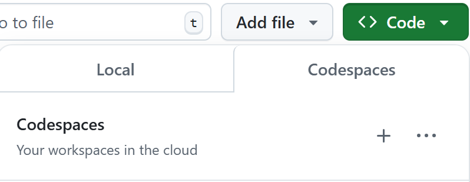

# How to do X

## Make a new Github codespace

Click `+` to the right of the `Codespaces` tab, under the greeen `Code` button, to make a new codespace.

Run `wget -q https://raw.githubusercontent.com/leanprover-community/mathlib4/master/scripts/install_debian.sh && bash install_debian.sh ; rm -f install_debian.sh && source ~/.profile` in the terminal to install elan and lake.

Run `source ~/.profile` in the terminal to set the PATH.

Run `lake exe cache get` in the terminal to get the mathlib cache.

Restart the lean file if it asks for it.

(Optional) Install the `Github Codespace` extension in VSCode, go to Remote Explorer, select `GitHub Codespace` from the dropdown at the top, and connect to your codespace. If `Remote Explorer` is not visible right-click on the sidebar and select `Remote Explorer`.
